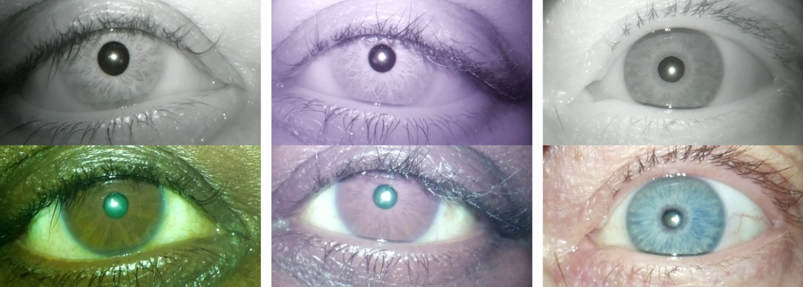
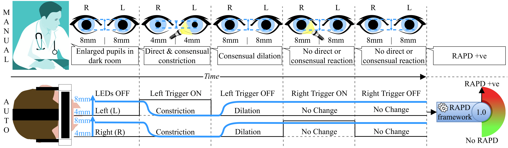
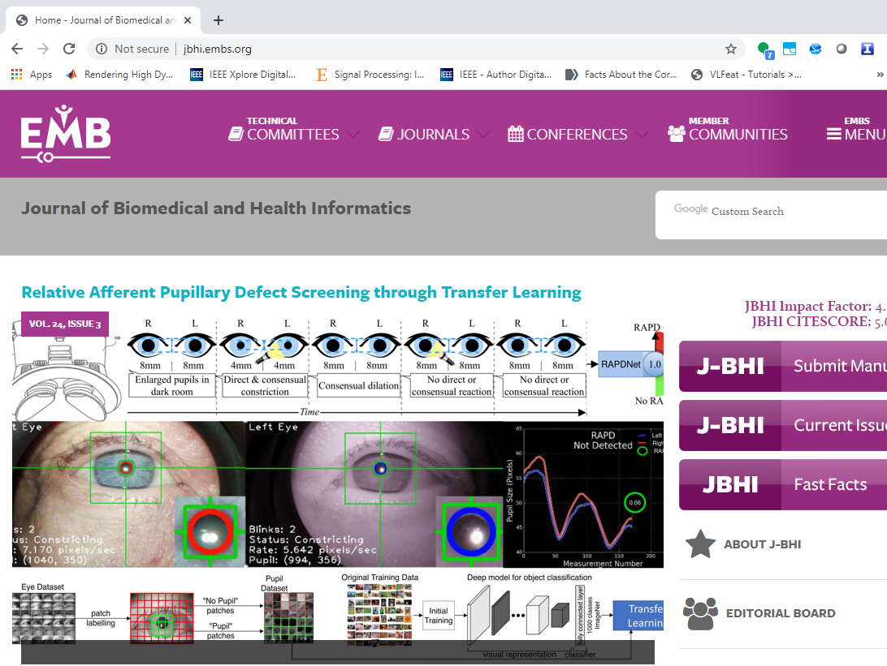
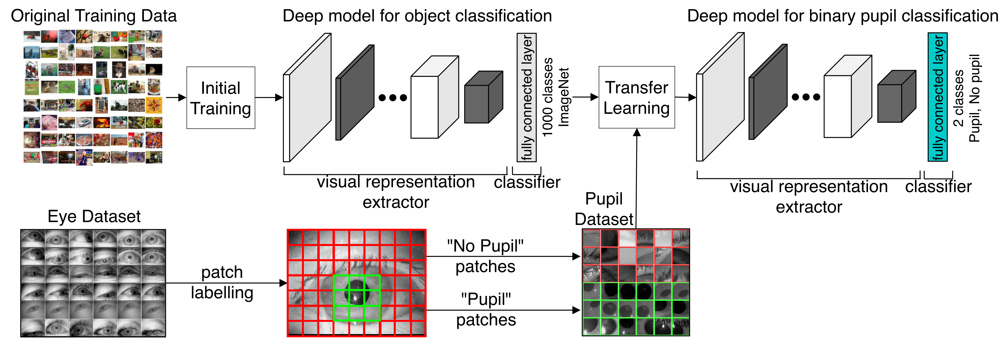
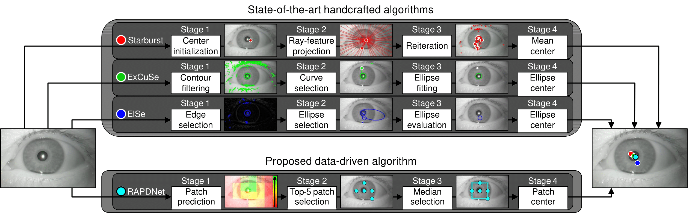

# RAPD
Healthcare Intelligence: RAPD Assessment

[OLIVES Lab, Georgia Institute of Technology](https://ghassanalregib.com/)

<p align="center"></p>

The goal of this project is to create artifical inteligence and innovative hardware designs for cost-effective, accessible eye care to assist eye care professionals in enhancing vision and preventing blindness. In this study, we focus on pupillary light reflex assessment, which can be an indicator of numerous conditions including but not limited to optic nerve disorders, trauma, autism, alcohol and recreational drugs, exposure to toxins, and response to infections. Specifically, we investigate the RAPD condition, which corresponds to relative afferent pupillary defect. RAPD is based on the differences between the reactions of the eyes when they are exposed to light.
In healthy subjects, light stimulation on one eye should lead to equal constriction of both pupils and constricted pupils should enlarge equally when there is no stimulation. In case of positive RAPD, patient’s pupils constrict less or do not constrict when light stimuli swings from the unaffected eye to the affected eye as shown below.

<p align="center"></p>


### Papers
Please cite:

 [Relative Afferent Pupillary Defect Screening
through Transfer Learning](https://arxiv.org/abs/1908.02300)
  
```
@inproceedings{Temel2019_BHI,
author      = {D. Temel and M. J. Mathew and G. AlRegib and Y. M. Khalifa},
booktitle   = {IEEE Journal of Biomedical and Health Informatics},
title       = {Relative Afferent Pupillary Defect Screening
through Transfer Learning},
year        = {2019},}
```
   
 [Automated Pupillary Light Reflex Assessment on a Portable Platform](https://arxiv.org/abs/1905.08886)

```
@INPROCEEDINGS{Temel2019_ISMR,
author      = {D. Temel and M. J. Mathew and G. AlRegib and Y. M. Khalifa},
booktitle   = {IEEE International Symposium on Medical Robotics},
title       = {Automated Pupillary Light Reflex Assessment on a Portable Platform},
year        = {2019},}
```

Our transfer learning-based RAPD screening paper is highlighted on the JBHI EMBS cover page!
<p align="center"></p>


# Benchmarked Algorithms
* Starburst: Pupil center is initialized as the image center in Stage 1 and rays are projected outwardly from the center to detect edge features via gradients in Stage 2. Then, pupil center is updated with mean feature location as shown with white circle from which rays are projected. These pupil center update and ray projection procedures are iterated until all the gradients are swept in Stage 3. Finally, pupil center is estimated based on mean location of the eventual feature points.
* ExCuSe [15]: Curved segments are obtained from Canny edge maps which are filtered to exclude thin lines and small rectangular surfaces in Stage 1. Then, longest curve thatencloses the darkest area is selected to project a ray between the curve and the image center in Stage 2. After the ray projection, an ellipse is fit around the estimated pupil in Stage 3 whose center corresponds to the pupil location.
* ElSe [16]: Canny edge maps are extracted based on the edges split around orthogonal connections with more than two neighbors. These detected edges are thinned and straightened to enhance curved segment selection. Then, ellipse fitting is performed over detected edges and a subset of ellipses are selected based on the intensity within elliptic regions and their width-height ratio. Finally, the ellipse with the lowest inner gray values and a width-height ratio 


# Proposed Algorithm
Visual representations learned by state-of-the-art object recognition models include low level characteristics based on edges and shapes. We cannot directly use these models for localizing or detecting pupils in eye images because they are originally trained for generic object recognition tasks in largescale datasets such as ImageNet. However, the visual representations learned by these models can still be useful for recognizing and localizing eye structures. In this study, we focus on convolutional neural networks (CNNs), which include
convolutional layers that learn visual representations and fully connected layers that map these visual representations to target
classes. Specifically, we use the AlexNet architecture that is based on five convolutional layers and three fully connected
layers.  We transformed this object recognition model into a pupil detector with transfer learning as shown below.

<p align="center"></p>

Transfer learning of AlexNet resulted in a pupil detection model denoted as RAPDNet. To localize pupils in an image, we scan the image with overlapping patches and classify each patch as pupil or no pupil with RAPDNet. After obtaining a class for each patch, we sort the pupil patches based on their classification confidence and compute the median location of the top-5 pupil patches with the highest confidence as shown below.

<p align="center"></p>


